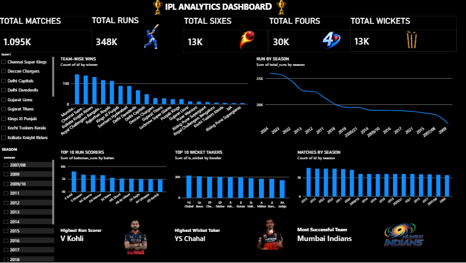

# IPL Power BI Dashboard

## 📊 Project Overview

An interactive Power BI dashboard created to analyze IPL match and player performance data.

## 🛠️ Tools Used

* Power BI
* Power Query
* DAX
* Data Cleaning & Transformation

## 📈 Dashboard Features

* Team-wise performance analysis
* Player performance analysis
* Match statistics
* Season-wise analysis
* Interactive filters and visualizations

## 🖼️ Dashboard Preview

## 📁 Project Files

* `IPL_Dashboard.pbix` — Power BI dashboard file
* `IPL-Dashboard.png` — Dashboard preview

## 🎯 Objective

The objective of this project is to transform IPL data into an interactive dashboard and generate meaningful insights through data visualization.
